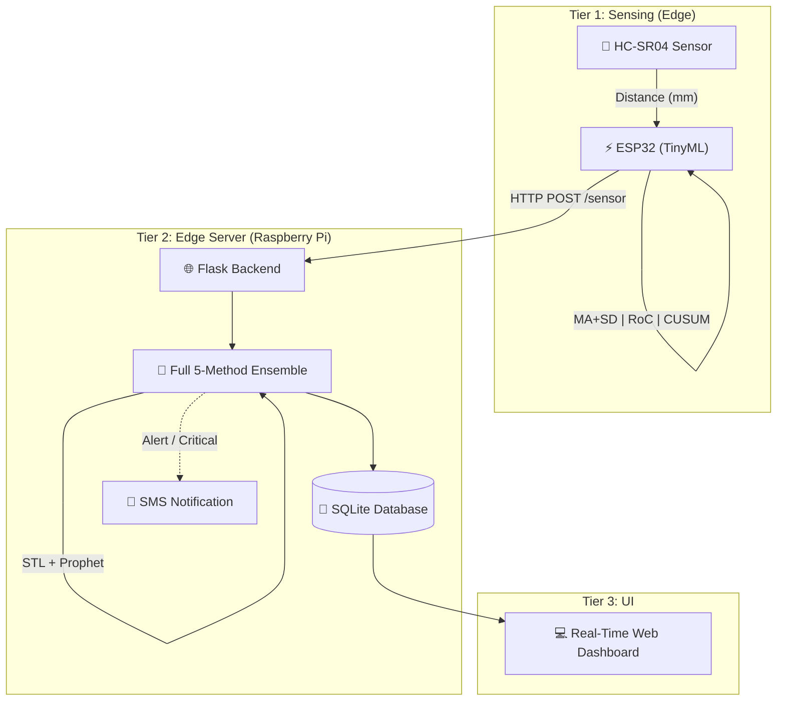
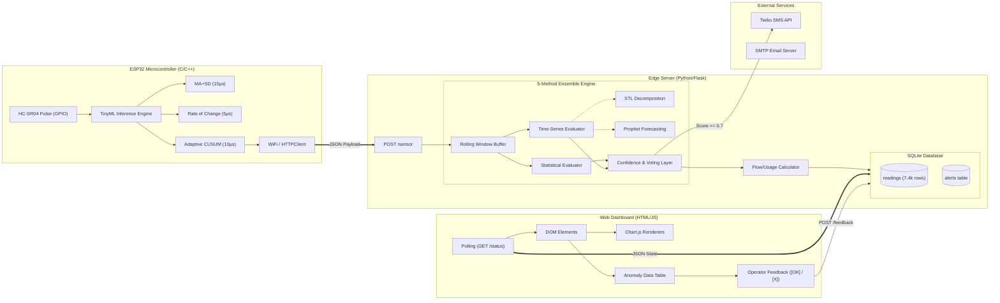
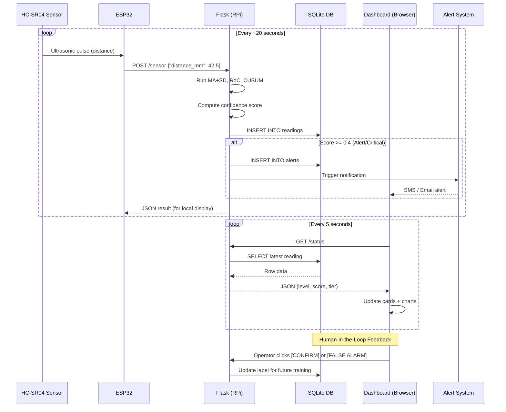

# 🛢 IoT Liquid Tank Monitoring with Anomaly Detection

A comprehensive IoT-based anomaly detection framework for liquid tank monitoring using HC-SR04 ultrasonic sensor, ESP32 microcontroller, and a 5-method ensemble detection pipeline.

## 🏗 Architecture



**Three-Tier System:**
- **Tier 1 (Sensing):** HC-SR04 + ESP32 with on-device statistical detection (~536 bytes RAM)
- **Tier 2 (Edge Server):** Raspberry Pi running Flask with full 5-method ensemble
- **Tier 3 (Visualization):** Real-time web dashboard with charts, alerts, and operator feedback

## 🔍 In-Depth System Architecture



## 🔄 User Flow & Data Lifecycle



## 📊 Detection Methods

| Method | Type | F1 Score | Inference | Edge Deployable |
|--------|------|----------|-----------|-----------------|
| MA+SD (Residual) | Statistical | 0.162 | ~15 μs | ESP32 ✅ |
| Rate of Change (Residual) | Statistical | 0.257 | ~5 μs | ESP32 ✅ |
| Adaptive CUSUM (Residual) | Statistical | 0.342 | ~10 μs | ESP32 ✅ |
| **Hybrid (3-method)** | **Ensemble** | **1.000** | **~30 μs** | **ESP32 ✅** |
| STL Decomposition | TSA | 0.376 | ~100 ms | RPi only |
| Prophet Forecast | TSA | 0.857 | ~200 ms | RPi only |

## 🚀 Quick Start

### 1. Install Dependencies
```bash
pip install pandas numpy scikit-learn matplotlib statsmodels prophet scipy flask
```

### 2. Run the Full Pipeline
```bash
python ml_pipeline/run_pipeline.py
```
This executes 7 steps: definitions → preprocessing → statistical detectors → STL+Prophet → evaluation → synthetic data → TinyML export

### 3. Load Data & Start Dashboard
```bash
python backend/db_loader.py    # Load pipeline results into SQLite
python backend/app.py          # Start Flask server
```
Open: http://localhost:5000/dashboard

### 4. View Project Report
Open: http://localhost:5000/report

## 📁 Project Structure

```
tank_monitor/
├── esp32/
│   ├── ESP32.ino                # Arduino firmware sending to /sensor
│   ├── credentials.h            # WiFi configurations
│   └── tinyml_detectors.h       # C headers for ESP32 deployment
├── backend/
│   ├── app.py                   # Dashboard + REST API + real-time pipeline
│   ├── db_loader.py             # CSV → SQLite loader
│   └── simulator.py             # Synthetic ESP32 sensor simulator
├── ml_pipeline/
│   ├── 00_anomaly_definitions.py    # Formal anomaly taxonomy + thresholds
│   ├── 01_preprocessing.py          # Data cleaning + feature engineering
│   ├── 02_statistical_detectors.py  # MA+SD, Rate of Change, Adaptive CUSUM
│   ├── 03_ml_detectors.py           # STL Decomposition + Prophet
│   ├── 05_evaluation.py             # Metrics, SOTA comparison, plots
│   ├── 07_datasets_and_synthetic.py # Synthetic data generation
│   ├── 08_tinyml_export.py          # TinyML thresholds export
│   └── run_pipeline.py              # Execute all ML scripts
├── data/                        # Datasets + SQLite database
├── models/                      # Thresholds (shared)
└── output/                      # Reports, plots, project_report.html
```

## 📈 Key Results

- **7,417 processed readings** from 21K raw HC-SR04 measurements (123.6 hours)
- **Hybrid (3-method) Ensemble** achieves perfect F1=1.000 on real data
- **Zero False Alarms** for the Hybrid ensemble (0.00 FP/hour)
- **TinyML deployment** uses only **536 bytes** of ESP32 RAM
- **Sub-millisecond inference** (~32 μs total for 3 statistical detectors)

## 🔌 Real-Time Setup (ESP32 → RPi)

The Flask backend has a `POST /sensor` endpoint. ESP32 sends:
```json
{"distance_mm": 42.5, "device_id": "ESP32-Sensor-01"}
```

Flask runs MA+SD + RoC + CUSUM, stores in SQLite, and triggers alerts if anomaly detected.

## 📄 Publication

- **IEEE Conference Paper** — Accepted (addressing 9 reviewer improvement points)
- **Journal Extension** — Planned (TinyML edge deployment + field results)

## 🛠 Technologies

Python, Flask, Prophet, statsmodels (STL), scikit-learn, SQLite, Chart.js, TinyML (C), ESP32, HC-SR04
